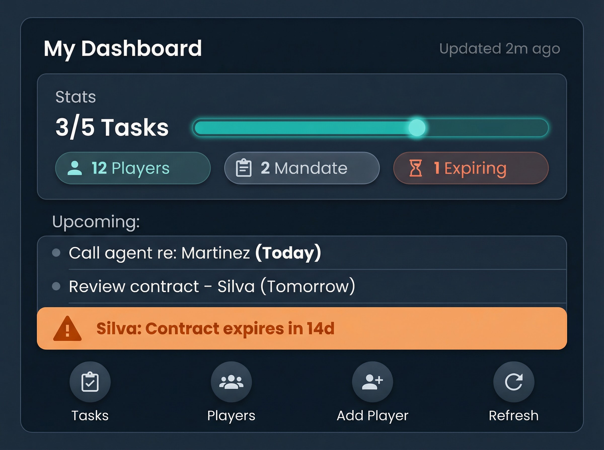
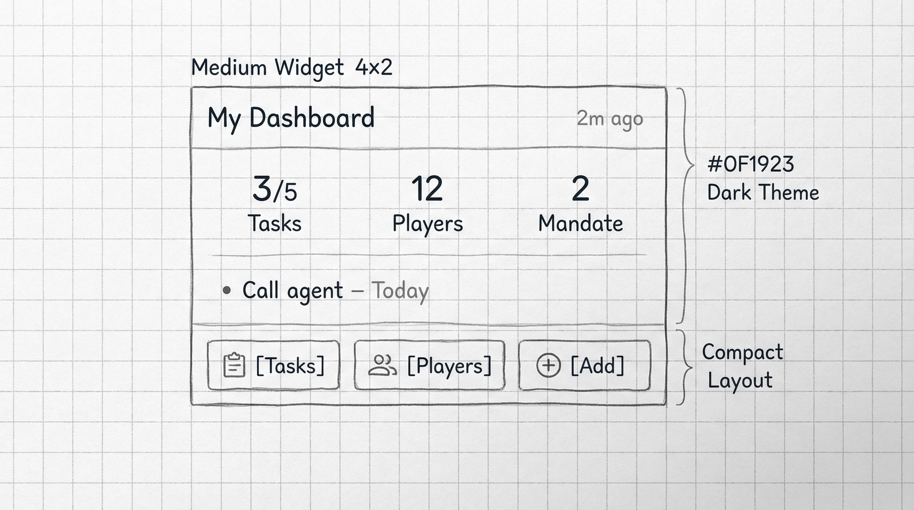
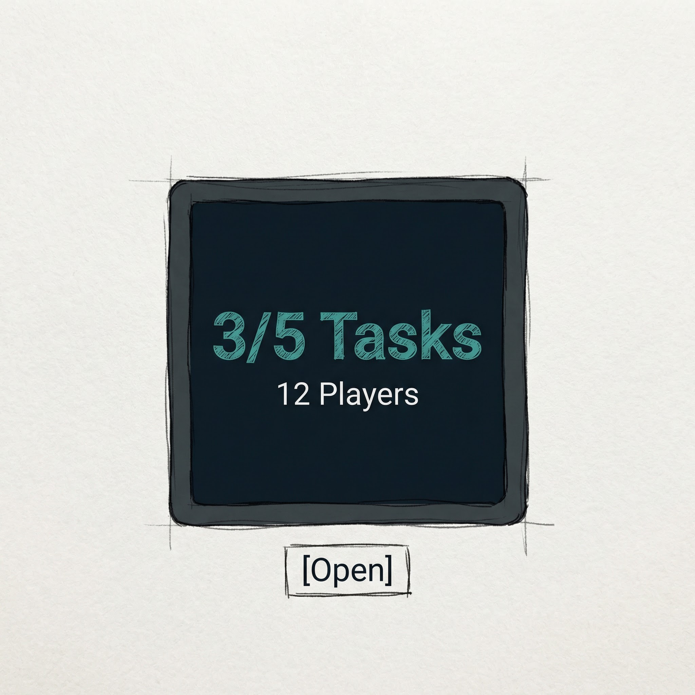

# Widget Improvement Plan — MGSR Team Agent Dashboard

> **Goal:** Massive improvement to the home screen widget: better app communication, reliable updates, richer UI, action buttons, and more info.

---

## 1. Current State Analysis

### 1.1 Communication & Updates

| Aspect | Current | Problem |
|--------|---------|---------|
| **Data source** | SharedPreferences (`WidgetDataStore`) | ✅ Cross-process, works |
| **When data is written** | Only when user opens Dashboard | ❌ Stale if user hasn't opened app |
| **Update trigger** | `WidgetUpdateHelper.syncToWidget()` from `DashboardScreen` LaunchedEffect + ViewModel | ❌ No background/periodic refresh |
| **Widget refresh** | `AgentDashboardWidget().updateAll(context)` | ✅ Correct Glance API |

**Root cause:** Widget is **passive** — it only updates when the app is opened and Dashboard loads. No refresh button, no WorkManager, no push-based update.

### 1.2 UI Issues

| Issue | Detail |
|-------|--------|
| **Single tap target** | Entire widget opens app — no granular actions |
| **No action buttons** | Can't jump to Tasks, Players, Add Player, etc. |
| **Cramped stats** | 4 stat chips in one row, small text |
| **Vague CTA** | "Tap to open" — open what? |
| **No freshness indicator** | User doesn't know if data is current |
| **Weak empty state** | "Players assigned to you will appear here" — no guidance |
| **No visual hierarchy** | Everything looks same importance |
| **No icons** | Stats/tasks lack visual anchors |

### 1.3 Data Model (WidgetDataStore)

- `totalPlayers`, `withMandate`, `freeAgents`, `expiring`
- `completedTasks`, `totalTasks`, `overdueTasks`, `alertCount`
- `tasks` (up to 5), `alerts` (up to 3)
- **Missing:** `lastUpdatedMillis` (for "Updated 2m ago")

---

## 2. Proposed Architecture

### 2.1 Data Flow (New)

```
┌─────────────────────────────────────────────────────────────────────────┐
│                         DATA SOURCES                                     │
├─────────────────────────────────────────────────────────────────────────┤
│  1. App open (Dashboard)     →  ViewModel computes overview  →  sync     │
│  2. WorkManager (periodic)   →  Worker fetches Firestore     →  sync     │
│  3. Refresh button (widget) →  One-time WorkManager job     →  sync     │
│  4. Push notification       →  (optional) FCM triggers sync             │
└─────────────────────────────────────────────────────────────────────────┘
                                    │
                                    ▼
┌─────────────────────────────────────────────────────────────────────────┐
│  WidgetDataStore.save()  +  AgentDashboardWidget().updateAll()          │
└─────────────────────────────────────────────────────────────────────────┘
```

### 2.2 Sync Triggers (Implementation Order)

| Priority | Trigger | Implementation |
|----------|---------|----------------|
| **P1** | App opens Dashboard | ✅ Already exists |
| **P1** | Task/player changes in app | ✅ Already exists (ViewModel) |
| **P2** | Refresh button on widget | `actionRunCallback` → BroadcastReceiver → enqueue WorkManager one-time job |
| **P3** | Periodic background sync | WorkManager `PeriodicWorkRequest` (e.g. every 4–6h) |
| **P4** | Push notification | FCM data message triggers sync (optional) |

### 2.3 Widget Update Helper Enhancements

- Add `lastUpdatedMillis` to `WidgetDataStore`
- New `WidgetRefreshWorker` (WorkManager) that:
  - Uses FirebaseAuth + Firestore to fetch agent data
  - Builds `MyAgentOverview` (reuse logic from ViewModel or extract to repository)
  - Calls `WidgetUpdateHelper.syncToWidget()`
- `WidgetRefreshReceiver` (BroadcastReceiver) for Refresh button → enqueue worker

---

## 3. UI Redesign

### 3.1 Design Principles (Material 3 + Mobile Design Skill)

- **48dp minimum touch targets** for all action buttons
- **Thumb zone:** Primary actions (Open App, Tasks) at bottom
- **Clear hierarchy:** Stats → Tasks → Alerts → Actions
- **Icons** for every action (Material Symbols)
- **Last updated** timestamp for trust
- **Deep links** to specific screens (Tasks, Players, Add Player)

### 3.2 Widget Sizes

| Size | Dimensions | Use Case |
|------|------------|----------|
| **Small** | 2x2 (110×110dp) | Stats + Open button only |
| **Medium** | 4x2 (250×110dp) | Stats + 2–3 action buttons |
| **Large** | 4x3 (250×180dp) | Full layout: stats, tasks, alerts, actions |

**Recommendation:** Support all three with `resizeMode="horizontal|vertical"`. Use `BoxWithConstraints` or size-based composition in Glance to adapt layout.

### 3.3 Layout Structure (Large Widget)

```
┌─────────────────────────────────────────────────────────────┐
│  My Dashboard                                    [Updated 2m ago] │
├─────────────────────────────────────────────────────────────┤
│  ┌───────────────────────────────────────────────────────┐  │
│  │  3/5 Tasks    │  12 Players  │  2 Mandate  │  1 Expiring │  │
│  │  (progress)   │  (chips)     │            │             │  │
│  └───────────────────────────────────────────────────────┘  │
├─────────────────────────────────────────────────────────────┤
│  Upcoming:                                                   │
│  • Call agent re: Martinez          Today                    │
│  • Review contract – Silva          Tomorrow                 │
│  ⚠ Silva: Contract expires in 14d                            │
├─────────────────────────────────────────────────────────────┤
│  [Tasks]  [Players]  [Add Player]  [Refresh]                 │
└─────────────────────────────────────────────────────────────┘
```

### 3.4 Action Buttons

| Button | Icon | Action | Deep Link |
|--------|------|--------|-----------|
| **Tasks** | `Icons.Default.TaskAlt` | Open app → Tasks screen | `Intent` with `EXTRA_SCREEN = "tasks"` |
| **Players** | `Icons.Default.People` | Open app → My Players | `Intent` with `EXTRA_SCREEN = "players"` + `myPlayersOnly=true` |
| **Add Player** | `Icons.Default.PersonAdd` | Open app → Add Player | `Screens.AddPlayerScreen.route` |
| **Refresh** | `Icons.Default.Refresh` | Trigger sync (WorkManager) | `actionRunCallback` → BroadcastReceiver |

**Deep link handling:** MainActivity already has `handleDeepLink` with `EXTRA_SCREEN`. Extend to support `tasks`, `players`, `add_player`. Add `viewModel.setPendingOpenScreen(screen)` and navigate from HomeScreen.

---

## 4. Implementation Phases

### Phase 1: UI Overhaul (No new sync logic)

- [ ] Add `lastUpdatedMillis` to WidgetDataStore
- [ ] Redesign layout: header with timestamp, stats card, tasks, alerts, action row
- [ ] Add 4 action buttons (Tasks, Players, Add Player, Refresh)
- [ ] Implement deep links for Tasks, Players, Add Player (Intent extras)
- [ ] Refresh button: open app to Dashboard (triggers sync on load) — simple fallback
- [ ] Add responsive layout for small/medium sizes
- [ ] Add Material icons via Glance (use `Image` with vector or drawable)

### Phase 2: Refresh Button → Background Sync

- [ ] Create `WidgetRefreshReceiver` (BroadcastReceiver)
- [ ] Create `WidgetRefreshWorker` (CoroutineWorker)
- [ ] Extract Firestore fetch logic to shared `AgentOverviewRepository` or similar
- [ ] Refresh button uses `actionRunCallback` → send broadcast → enqueue one-time WorkManager job
- [ ] Worker fetches data, saves to WidgetDataStore, calls `updateAll()`

### Phase 3: Periodic Sync

- [ ] Add `PeriodicWorkRequest` for widget refresh (e.g. every 6h)
- [ ] Constrain to battery/network (WorkManager handles)
- [ ] Optional: sync only when device is charging or on Wi‑Fi

### Phase 4: Polish

- [ ] Empty state: "Add your first player" + Add Player button
- [ ] Loading state: show skeleton or "Updating…" when Refresh tapped
- [ ] RTL support for Hebrew
- [ ] Accessibility: content descriptions for all buttons

---

## 5. Glance API Notes

- **Buttons:** Use `Button` composable with `onClick = actionStartActivity(intent)` for Tasks/Players/Add Player
- **Refresh:** Use `actionRunCallback<WidgetRefreshCallback>()` — requires `ActionCallback` implementation
- **Icons:** Glance supports `ImageProvider(R.drawable.xxx)` — add vector drawables for each action
- **Conditional layout:** Use `when` on widget size (from `GlanceAppWidget.configuration`) or provide multiple `appwidget-provider` entries

---

## 6. Files to Create/Modify

| File | Action |
|------|--------|
| `WidgetDataStore.kt` | Add `lastUpdatedMillis`, update save/load |
| `WidgetUpdateHelper.kt` | Pass `lastUpdatedMillis` |
| `AgentDashboardWidget.kt` | Full UI redesign, action buttons |
| `agent_dashboard_widget_info.xml` | Optional: add `targetCellWidth/Height` for larger default |
| `MainActivity.kt` | Extend `handleDeepLink` for `EXTRA_SCREEN` = tasks, players, add_player |
| `IMainViewModel` / `MainViewModel` | Add `setPendingOpenScreen(screen)` |
| `HomeScreen.kt` | Handle `pendingOpenScreen` → navigate |
| `WidgetRefreshReceiver.kt` | **New** — receives broadcast from Refresh button |
| `WidgetRefreshWorker.kt` | **New** — fetches data, syncs widget |
| `WidgetRefreshCallback.kt` | **New** — Glance ActionCallback for Refresh |
| `strings.xml` | New strings: `widget_updated_ago`, `widget_tasks`, `widget_players`, etc. |

---

## 7. UI Sketches


*Full layout: stats, tasks, alerts, 4 action buttons*


*Compact: stats + 1 task + 3 action buttons*


*Minimal: key stats + Open button*

---

## 8. Success Criteria

- [ ] Widget shows last-updated timestamp
- [ ] At least 3 action buttons (Tasks, Players, Add Player) with deep links
- [ ] Refresh button triggers sync (Phase 2) or opens app (Phase 1)
- [ ] Layout adapts to small/medium/large sizes
- [ ] 48dp touch targets on all buttons
- [ ] Empty state has clear CTA
- [ ] RTL-friendly for Hebrew
