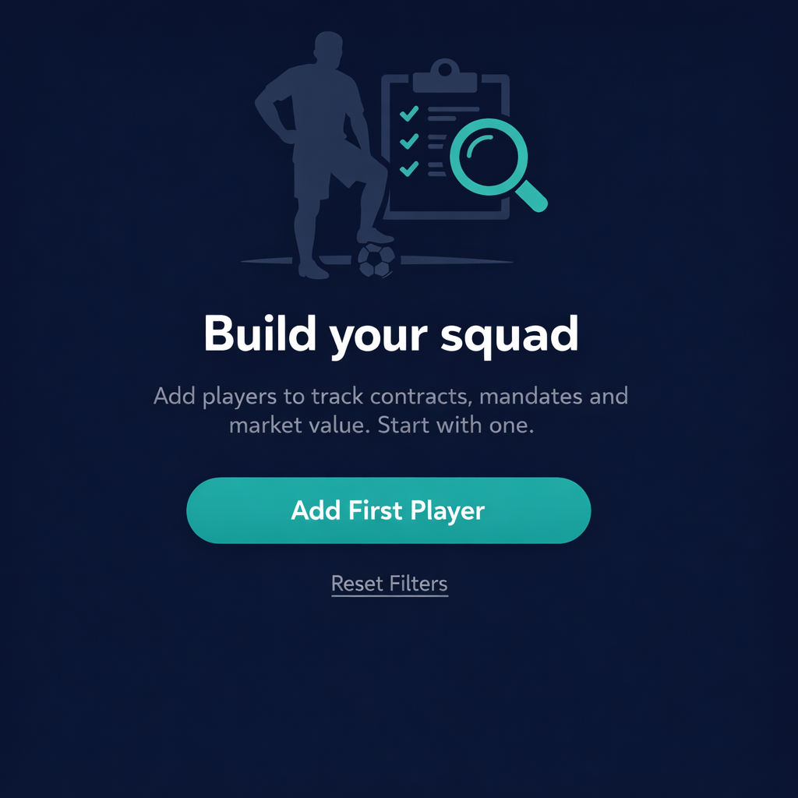

# Empty State Design Options — Players Screen

Based on research (FanDuel Design System, NNGroup, Material Design) and sports/agency context, here are **4 sketched options** for your "No players found" empty state. All use your existing dark theme (`HomeDarkBackground`, `HomeDarkCard`, `HomeTealAccent`).

---

## Option A — "Roster Pitch" (Sports Metaphor)


**Concept:** Use a football pitch / formation metaphor. Minimal, modern, sport-specific.

```
┌─────────────────────────────────────────────┐
│                                             │
│           [Illustration: Silhouette         │
│            of football pitch formation      │
│            with empty player spots —        │
│            greyed-out circles/positions]    │
│                                             │
│         "Your roster is empty"              │
│                                             │
│   Add your first player to start building   │
│   your squad and tracking their progress.   │
│                                             │
│         [  Add Player  ]  ← primary CTA      │
│                                             │
│         Reset Filters  ← secondary (ghost)  │
│                                             │
└─────────────────────────────────────────────┘
```

**Copy:** Short, sporty. "Your roster is empty" vs generic "No players found."  
**Visual:** Formation graphic (empty circles on a pitch) — suggestive of content, greyed per FanDuel.  
**CTA:** Primary = Add Player, Secondary = Reset Filters (for when filters cause empty).

---

## Option B — "Build Your Squad" (Action-Oriented)



**Concept:** Motivate user to create; imagery suggests success/team.

```
┌─────────────────────────────────────────────┐
│                                             │
│           [Illustration: Football player    │
│            with clipboard / scout vibes —   │
│            teal accent highlights]          │
│                                             │
│         "Build your squad"                  │
│                                             │
│   Add players to track contracts, mandates  │
│   and market value. Start with one.         │
│                                             │
│         [  Add First Player  ]              │
│                                             │
│   No filters? Try adjusting your search.    │
│         Reset Filters                       │
│                                             │
└─────────────────────────────────────────────┘
```

**Copy:** Encouraging, agency-focused (contracts, mandates, market value).  
**Visual:** Player + clipboard/scout — colored for onboarding/action.  
**CTA:** Single primary "Add First Player"; secondary Reset Filters link.

---

## Option C — "Empty Formation" (Minimal)


**Concept:** Very clean, icon-based, no heavy illustration.

```
┌─────────────────────────────────────────────┐
│                                             │
│                 [Icon: Football /           │
│                  squad silhouette           │
│                  in HomeTealAccent]         │
│                                             │
│         No players found                    │
│                                             │
│   Add players to your roster or clear       │
│   filters to see your full list.            │
│                                             │
│         [  Add Player  ]  [ Reset Filters ] │
│                                             │
└─────────────────────────────────────────────┘
```

**Copy:** Short and neutral.  
**Visual:** Simple icon or small illustration.  
**CTA:** Both actions visible at once.

---

## Option D — "Contextual Split" (Two States)

**Concept:** Two different empty states for two different scenarios.

**Scenario 1 — No players at all (first launch):**
- Illustration: Colorful "Add your first player" style
- Copy: "Your roster is empty"
- CTA: "Add Player" only

**Scenario 2 — Filters applied, no results:**
- Illustration: Greyed "search empty" / filter icon
- Copy: "No matches for your filters"
- CTA: "Reset Filters" primary, "Add Player" secondary

```
┌─────────────────────────────────────────────┐
│  STATE A: No players at all                 │
│  [Color illustration]                       │
│  "Your roster is empty"                     │
│  "Start by adding your first player"        │
│  [  Add Player  ]                           │
└─────────────────────────────────────────────┘

┌─────────────────────────────────────────────┐
│  STATE B: Filters hiding results           │
│  [Greyed filter/search illustration]        │
│  "No matches for your filters"              │
│  "Try adjusting your search or filters"     │
│  [ Reset Filters ]  [ Add Player ]           │
└─────────────────────────────────────────────┘
```

**Copy:** Different messaging per scenario.  
**Visual:** Color vs greyed per FanDuel.  
**CTA:** Primary action depends on context.

---

## Recommendation

| Option | Best for | Pros | Cons |
|--------|----------|------|------|
| **A** | Sport agency feel | Clear metaphor, suggestive of content | Needs custom illustration |
| **B** | Engagement | Strong CTA, agency value | More copy |
| **C** | Simplicity | Fast to implement, low effort | Less distinctive |
| **D** | Best UX | Context-aware, less frustration | Two designs to maintain |

**Suggested:** Combine **A** (visual + copy) with **D** (context logic). Use:
- Option A layout when no players at all
- Option D State B when filters applied

---

## Illustration Resources

- **unDraw:** [Select player](https://undraw.co/illustration/select-player_sppe) — free SVG, customizable
- **IconScout:** Football team / squad illustrations
- **Noun Project:** Sport player agent icons (line/solid)
- **Custom:** Formation pitch with empty circles (match your existing dark theme)

---

## Visual Treatment (Dark Theme)

- **Background:** `HomeDarkBackground`
- **Card (optional):** `HomeDarkCard` for content container
- **Primary text:** `HomeTextPrimary` (18sp bold)
- **Secondary text:** `HomeTextSecondary` (13sp)
- **Primary CTA:** `HomeTealAccent` background, `HomeDarkBackground` text
- **Secondary CTA:** Ghost / outlined style
- **Illustration:** Greyed (`HomeTextSecondary` ~40% opacity) for filter-empty; colored (`HomeTealAccent` accents) for first-time empty
