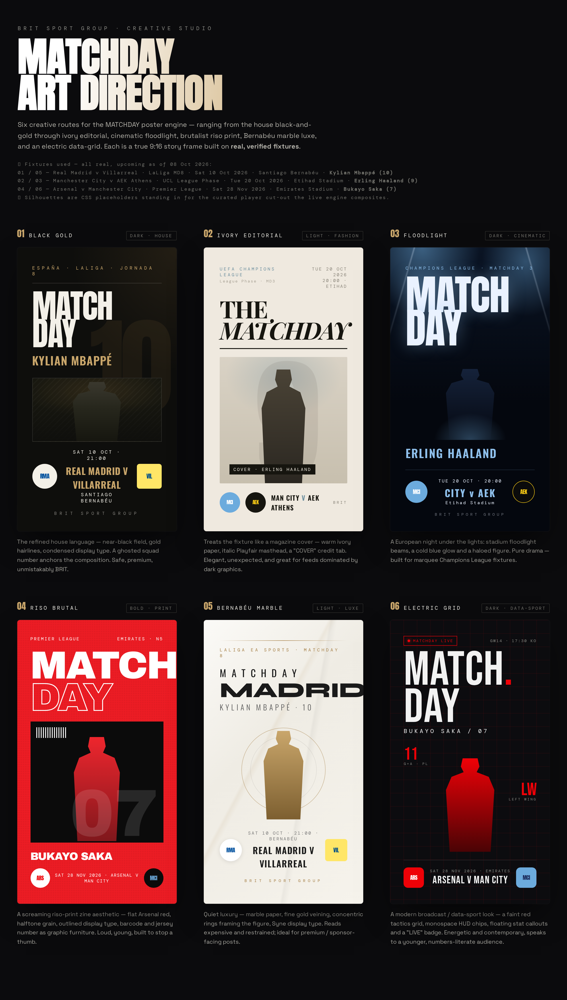
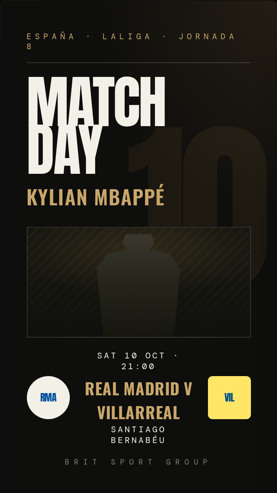
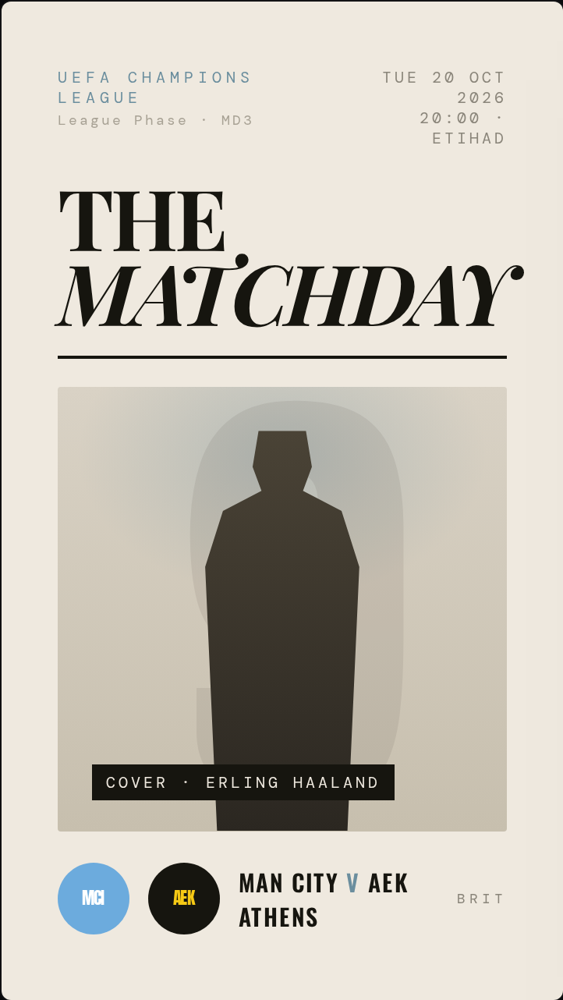
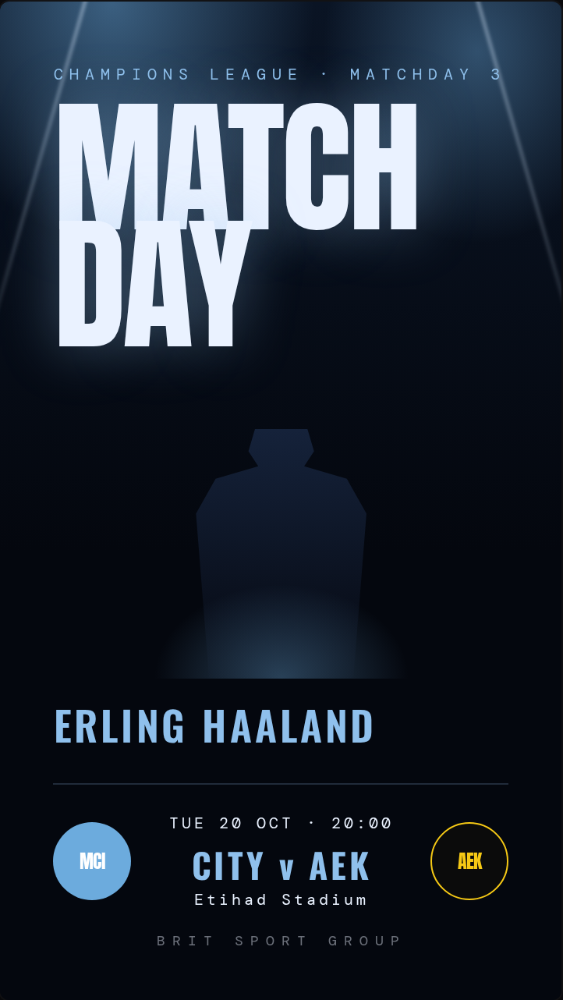
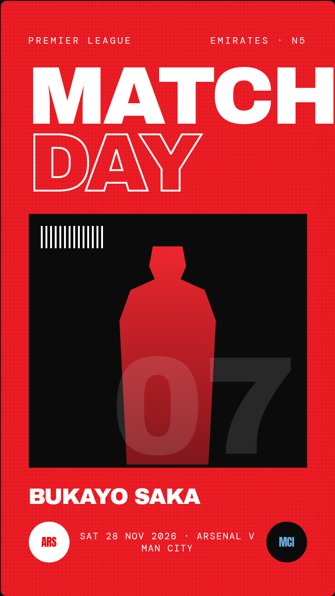
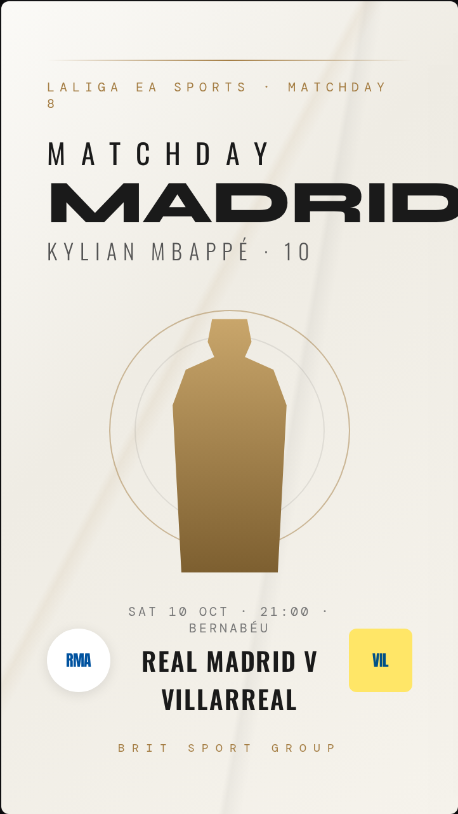
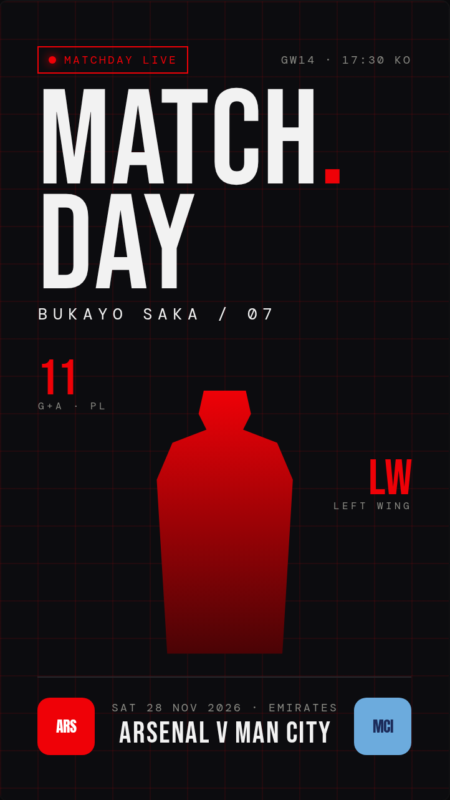

# MATCHDAY — Art Direction Studies

Six creative routes for the **MATCHDAY** poster engine, ranging from the house
black-and-gold through ivory editorial, cinematic floodlight, brutalist riso
print, Bernabéu marble luxe, and an electric data-grid.

Each is a true **9:16** Instagram-Story frame built on **real, verified fixtures**
(upcoming as of 08 Oct 2026). The player figure is a CSS placeholder standing in
for the curated player cut-out the live engine composites — everything else
(teams, crests, dates, kickoff, venue, competition) is real.

> The interactive source lives at [`../matchday-mockups.html`](../matchday-mockups.html).
> The images below are rendered straight from it.

## Fixtures used

| # | Fixture | Competition | Date | Venue | Player |
|---|---------|-------------|------|-------|--------|
| 01 / 05 | Real Madrid v Villarreal | LaLiga MD8 | Sat 10 Oct 2026 · 21:00 | Santiago Bernabéu | **Kylian Mbappé (10)** |
| 02 / 03 | Manchester City v AEK Athens | UCL League Phase | Tue 20 Oct 2026 · 20:00 | Etihad Stadium | **Erling Haaland (9)** |
| 04 / 06 | Arsenal v Manchester City | Premier League | Sat 28 Nov 2026 | Emirates Stadium | **Bukayo Saka (7)** |

---

## The full gallery

---

## 01 · Black Gold — _dark · house style_

The refined house language — near-black field, gold hairlines, condensed display
type. A ghosted squad number anchors the composition. Safe, premium, unmistakably BRIT.

## 02 · Ivory Editorial — _light · fashion-magazine_

Treats the fixture like a magazine cover — warm ivory paper, italic Playfair
masthead, a "COVER" credit tab. Elegant, unexpected, and great for feeds dominated
by dark graphics.

## 03 · Floodlight — _dark · cinematic night_

A European night under the lights: stadium floodlight beams, a cold blue glow and
a haloed figure. Pure drama — built for marquee Champions League fixtures.

## 04 · Riso Brutal — _bold · print-zine_

A screaming riso-print zine aesthetic — flat Arsenal red, halftone grain, outlined
display type, barcode and jersey number as graphic furniture. Loud, young, built to
stop a thumb.

## 05 · Bernabéu Marble — _light · quiet luxury_

Marble paper, fine gold veining, concentric rings framing the figure, Syne display
type. Reads expensive and restrained; ideal for premium / sponsor-facing posts.

## 06 · Electric Grid — _dark · broadcast / data-sport_

A modern broadcast / data-sport look — a faint red tactics grid, monospace HUD
chips, floating stat callouts and a "LIVE" badge. Energetic and contemporary, speaks
to a younger, numbers-literate audience.

