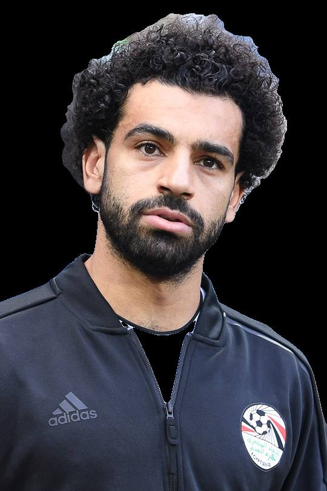
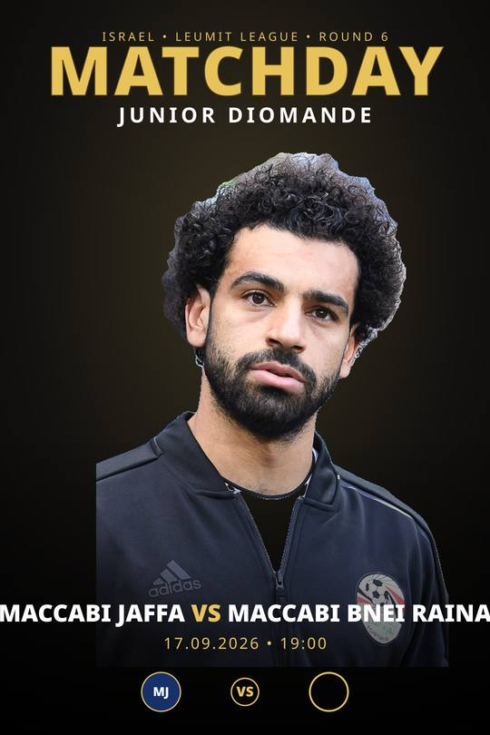
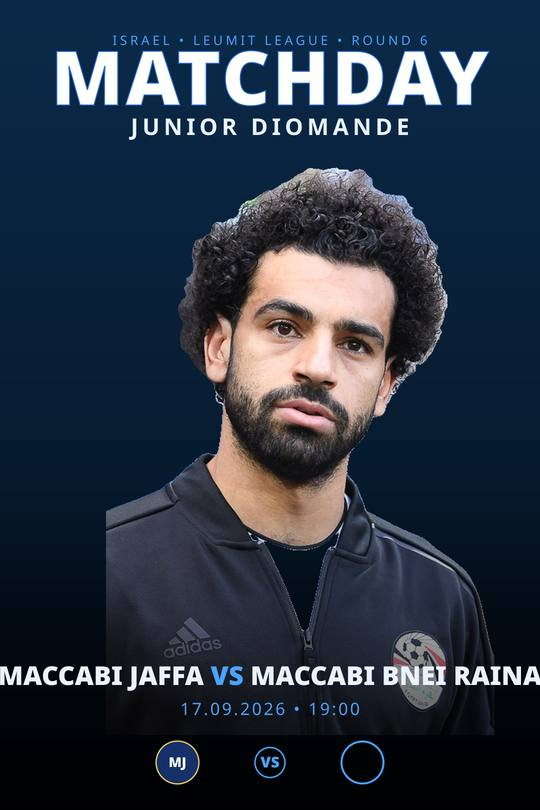
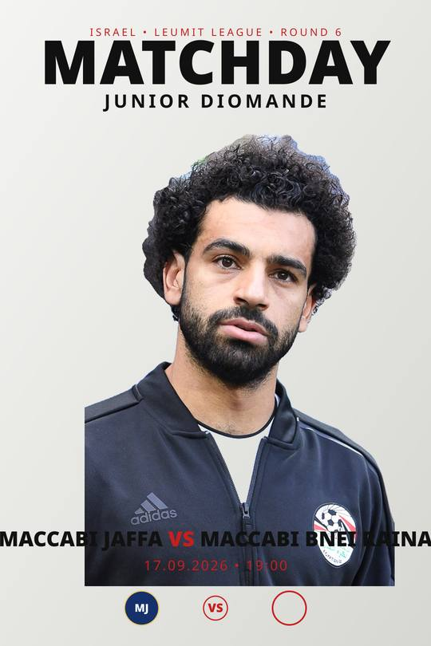

# MATCHDAY generator — proof of concept previews

These are **throwaway POC images** to validate the on-demand MATCHDAY flow.
Nothing here is wired into the app. They prove the approach:

**normal photo → auto background-removal (cutout) → composite real pixels onto a chosen template → accurate match info → deterministic render**

The player's face is never regenerated by AI — it is the exact uploaded photo,
pasted onto a background we build (collage, not painting).

## Images

### 1. The cutout (background auto-removed)

### 2. Template: Gold Drama

### 3. Template: Night Blue

### 4. Template: Clean Modern

> Sample player photo (Salah, Wikimedia) + placeholder fixture text/crests used
> only for the test. The real app sources accurate teams/date/crests from
> `facts.ts` + `crests.ts`.
