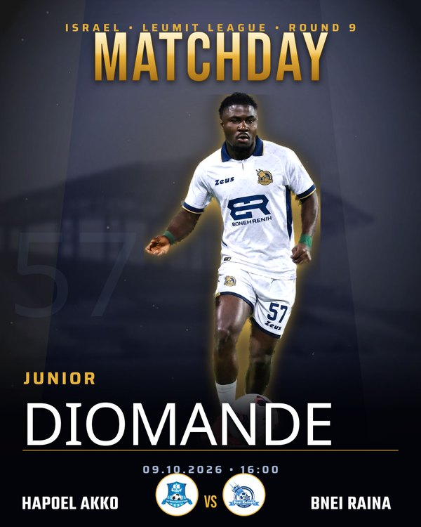
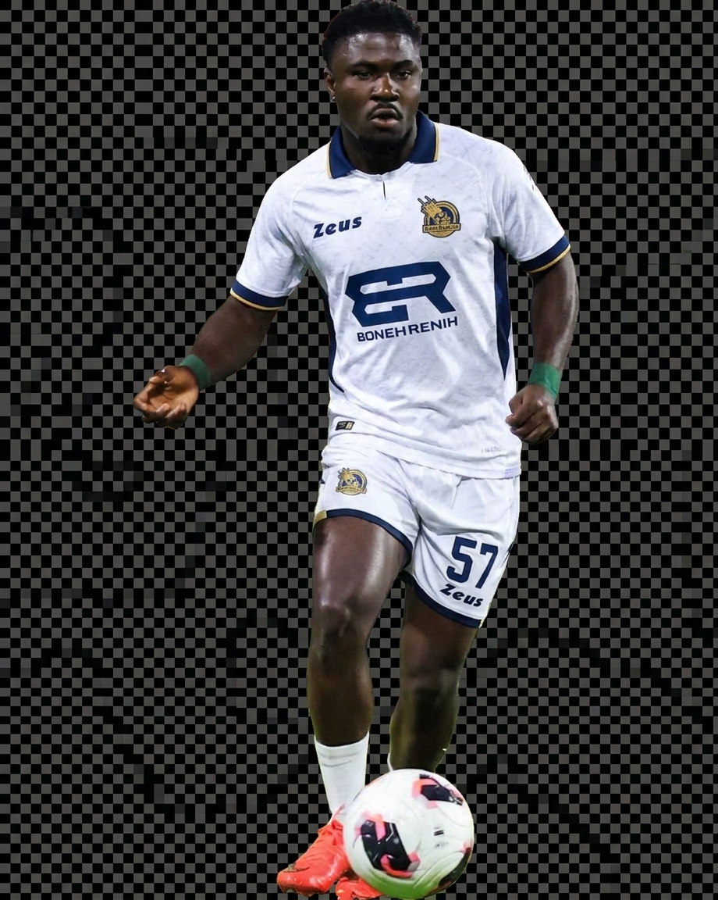
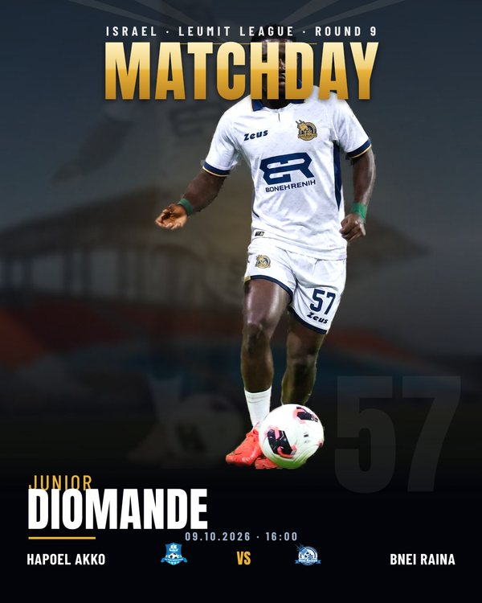

# MATCHDAY POC — Results

On-demand matchday posters. **No face is ever generated** — the real player photo is cut out
and composited. Only the *clothing* was repainted (kit swap) from a real kit reference, with
the face strictly locked. All match facts, crests, and fixture info are real/sourced.

## Final poster (v4)

Premium redesign following sports-graphic best practices: big hero with full headroom,
gold rim-light separation, duotone navy stadium + haze, auto-fit massive surname, zoned
bottom layout (no collisions), premium circular crest badges, balanced number watermark.

**Match:** Junior Diomande · Hapoel Akko vs Bnei Raina · Leumit League Round 9 · 09.10.2026 · 16:00

> Full resolution: `matchday_final.png` (1080×1350)

## Kit swap step (Gemini, face-locked)

Real photo → background removed → Gemini repainted **only shirt/shorts** into the white
Bnei Reineh #57 kit from a reference image. Face, hair, pose, ball preserved.

## Pipeline
1. Player photo → background removal (rembg)
2. Kit swap — face LOCKED, shirt repainted from real kit reference (Gemini)
3. Re-cut clean + build gold rim-light glow
4. Deterministic compositing (sharp): duotone stadium, hero, typography, crest badges, fixture
5. Accurate facts/crests sourced from data, never AI

## Known minor item
- Sponsor on chest renders as the real "ER / BONEH RENIH" sponsor (legit); chest crest slightly soft.

## Earlier iterations

