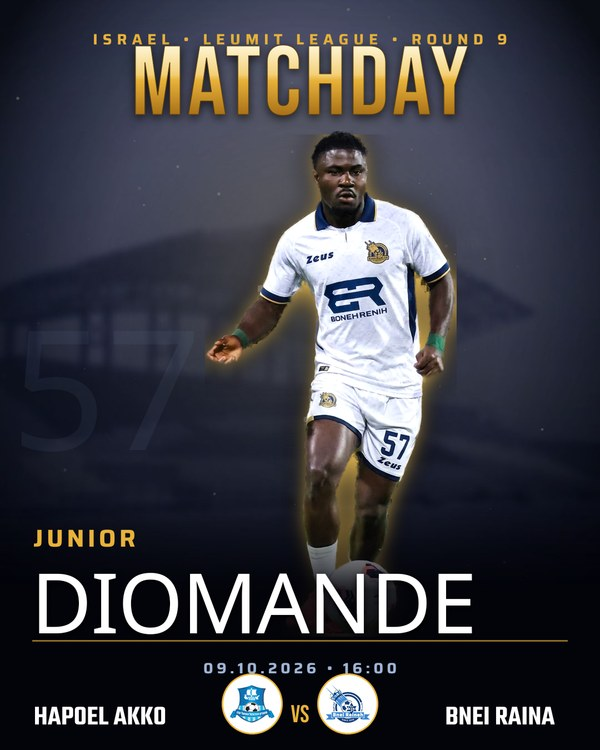
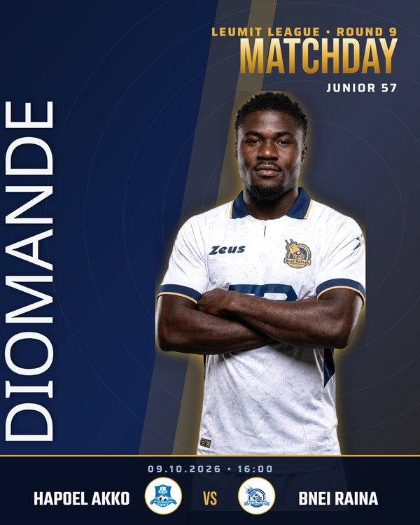
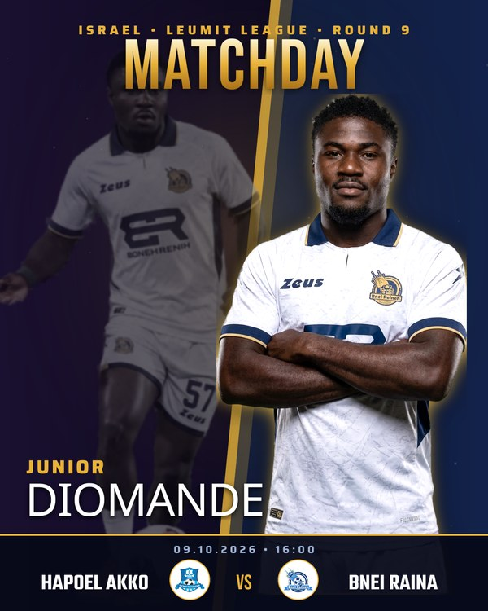
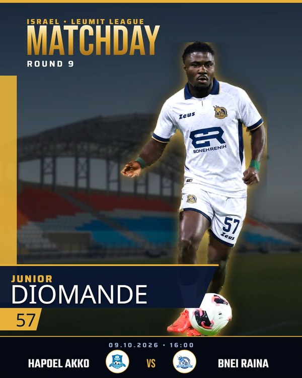

# MATCHDAY POC — Design System

Four unique, named matchday templates — each pixel-polished. **No face is ever generated.**
The real player photo is cut out and composited. The player's shirt (kit swap) and a *second
pose* were produced with Gemini while the **face/identity was strictly preserved** — only
clothing and body pose change, never the face.

**Match:** Junior Diomande · Hapoel Akko vs Bnei Raina · Leumit League Round 9 · 09.10.2026 · 16:00

Two real, face-safe poses are used across the designs:
- **Pose 1** — dynamic dribbling action (with ball)
- **Pose 2** — arms-crossed studio hero (AI-posed, face preserved)

---

## SPOTLIGHT
Cinematic single-hero. Duotone navy stadium, gold rim-light, haze, protected title band.

## STATEMENT
Bold typographic. Massive vertical surname up the left, arms-crossed portrait, high-contrast navy/gold.

## DUEL
Dual-pose. Faded action pose + sharp hero pose, split by a diagonal gold seam. High energy.

## BROADCAST
Sports-TV look. Angled lower-third panel, gold number tab, kickoff ticker, bright real stadium.

---

> Full-resolution PNGs (1080×1350): `design_spotlight.png`, `design_statement.png`, `design_duel.png`, `design_broadcast.png`

## Pipeline
1. Player photo → background removal (rembg)
2. Kit swap — face LOCKED, shirt repainted from real kit reference (Gemini)
3. Second pose — face LOCKED, body re-posed (Gemini)
4. Clean re-cut + gold rim-light glow per pose
5. Deterministic compositing (sharp): each named template, accurate fixture/crests
