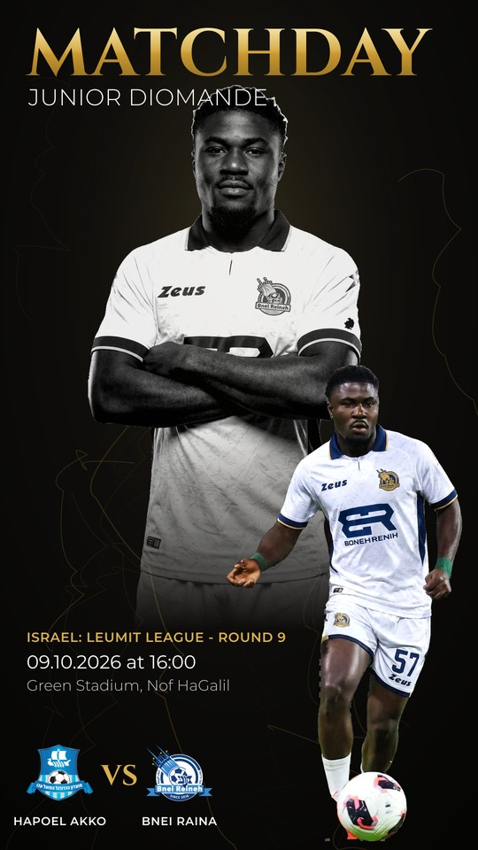
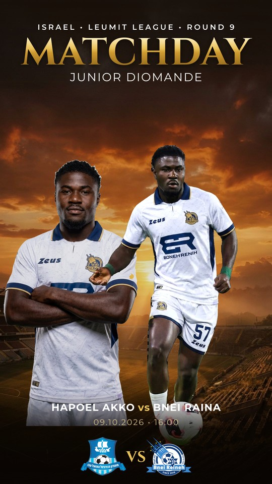
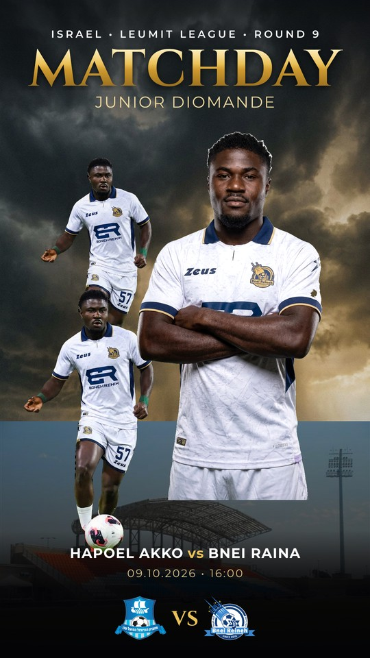
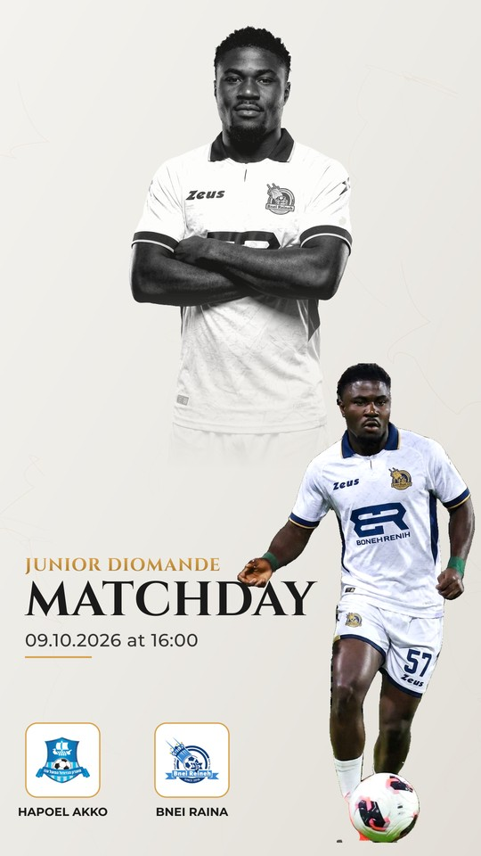
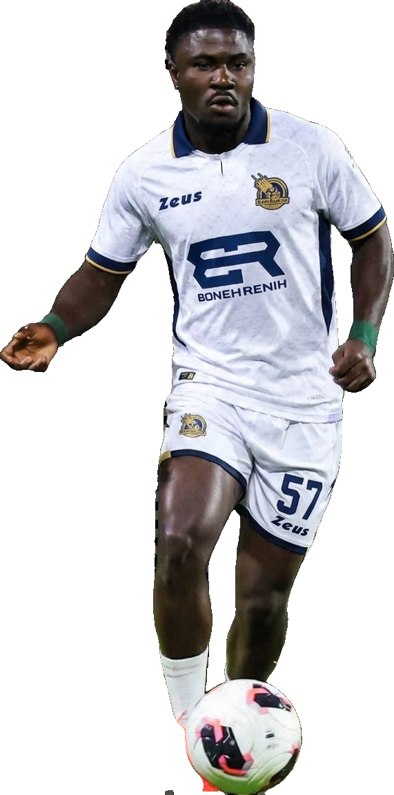

# MATCHDAY — Redesigned Design System (reference-grade)

Rebuilt to match the professional reference posters, at **true 9:16 (1080×1920)**.

**Key fixes this round**
- **Cutout** — now hard, natural edges via `isnet-general-use` (no alpha-matting), and the
  ugly rim-light **glow was removed entirely**. Second player cropped out.
- **Signature composition** — large **monochrome portrait backdrop** + sharp **color action
  cutout** in front, exactly like the references.
- **Typography** — elegant **Cinzel** serif gold "MATCHDAY" (matching the refs), Montserrat info.
- **Backgrounds** — black/white marble textures, AI-generated golden-hour & storm skies, stadium bands.
- Face is never generated; the kit swap + second pose preserve identity (only clothing/pose change).

**Match:** Junior Diomande · Hapoel Akko vs Bnei Raina · Leumit League Round 9 · 09.10.2026 · 16:00

---

## MIDNIGHT  — black marble, mono portrait + color action

## GOLDEN HOUR  — sunset stadium sky, two poses

## STORM  — storm sky, three-pose composition, stadium base

## MARBLE  — clean white marble, mono portrait, rounded crest frames

---

### Clean cutout (no glow, hard edges)

> Full-resolution PNGs (1080×1920): `v2_midnight.png`, `v2_golden.png`, `v2_storm.png`, `v2_marble.png`
